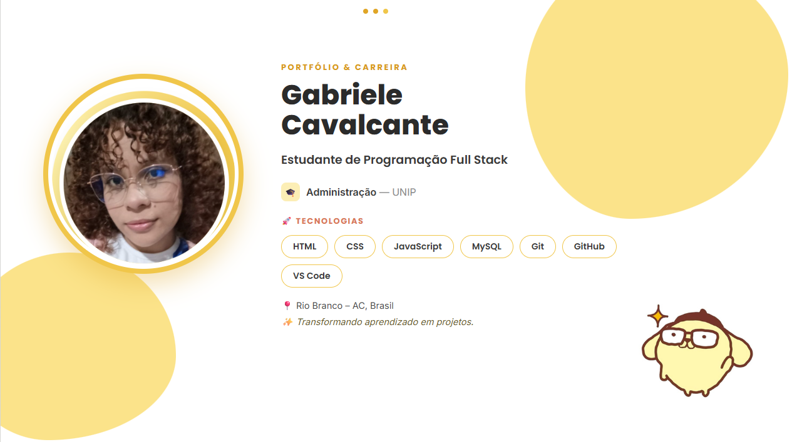

<!-- Banner -->

  

<h1 align="center">Olá! Eu sou a Gabriele Cavalcante 👋</h1>

<h3 align="center">
💻 Estudante de Programação Full Stack • 🎓 Administração • 🚀 Desenvolvedora em formação
</h3>

  

 👩‍💻 Sobre mim

🎓 Estudante do curso **Programador Full Stack** na **Escola SENAI**

📚 Graduanda em **Administração** pela **Universidade Paulista (UNIP)**

💙 Apaixonada por tecnologia, programação e desenvolvimento web.

🚀 Buscando aprimorar meus conhecimentos para conquistar minha primeira oportunidade na área de desenvolvimento.

 🚀 Tecnologias que estou aprendendo

📊 Estatísticas do GitHub

🔥 Sequência de Contribuições

🌱 Atualmente estudando

- HTML5
- CSS3
- JavaScript
- MySQL
- Banco de Dados
- Desenvolvimento Web

📂 Projetos em destaque

⭐ Portfólio

⭐ Espaço Bela

⭐ Clínica de Psicologia

⭐ Segurança da Informação

📫 Contato

Obrigada pela visita! 💜

*"Cada linha de código representa um novo aprendizado."*

